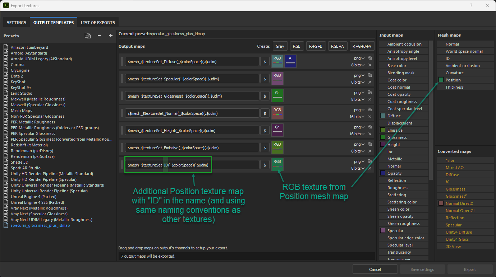

Python script for combining textures exported from Substance Painter into a single texture.
Substance Painter creates a separate set of textures (diffuse, height, normal, etc...) for each material (e.g. body, eyes, clothes).
This script will combine all textures of the same type (e.g. all diffuse, all normal etc...) for the same UDIM into a single texture atlas.


# Usage
1. Configure Substance Painter (or your texturing program) to export textures and an idmap.
2. Run `python3 main.py` in the root directory of this project.

# Substance Painter
## 1: Setup an export template like the following
 

Note:
1. Exported ID map uses same naming conventions as other textures, and includes "ID" in name

## 2: Run the script
```
python3 main.py ./texturesCreatedFromSubstance/*.png ./output
```
This will spit out a texture for each type of texture (basecolor, normal, etc) in the `output` folder.